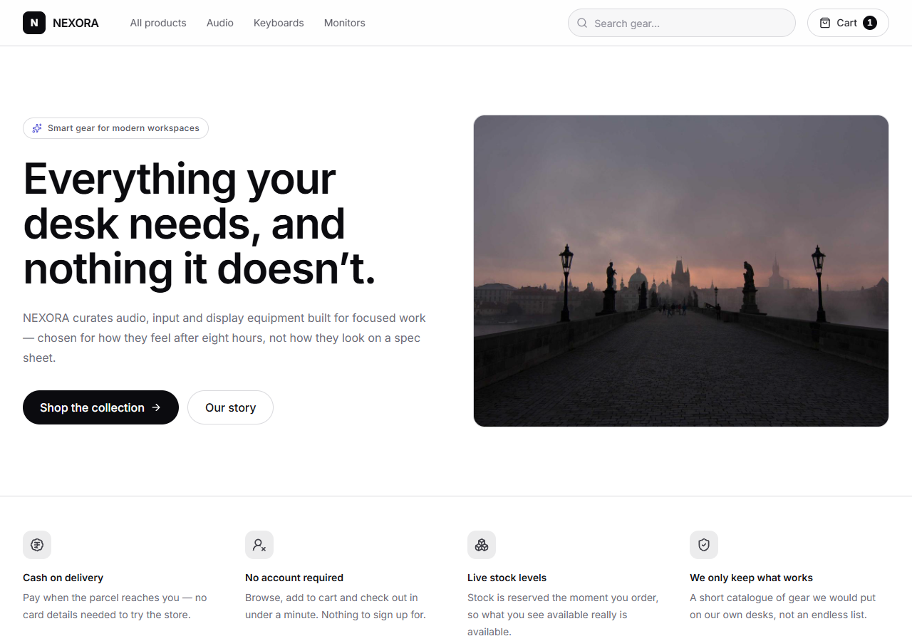
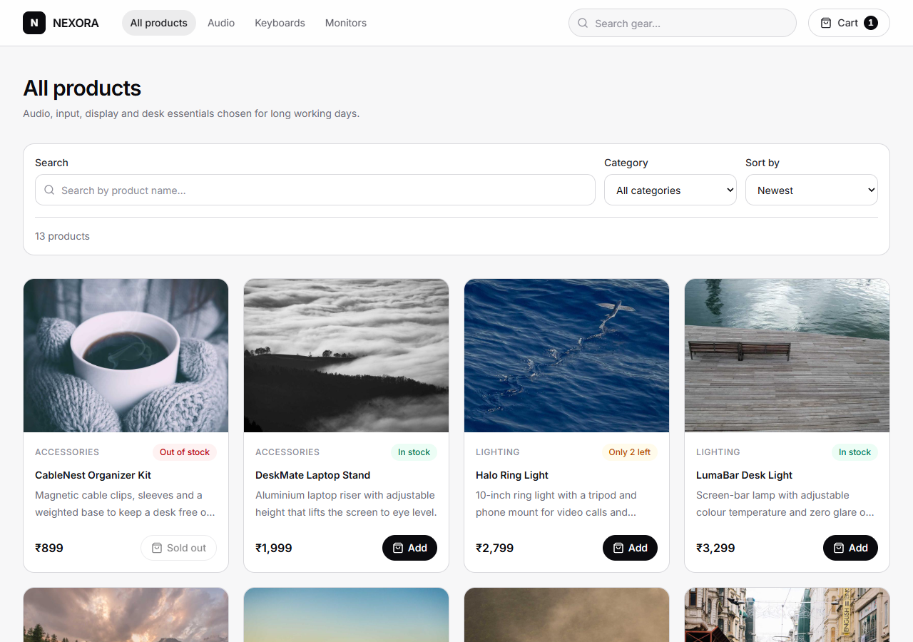
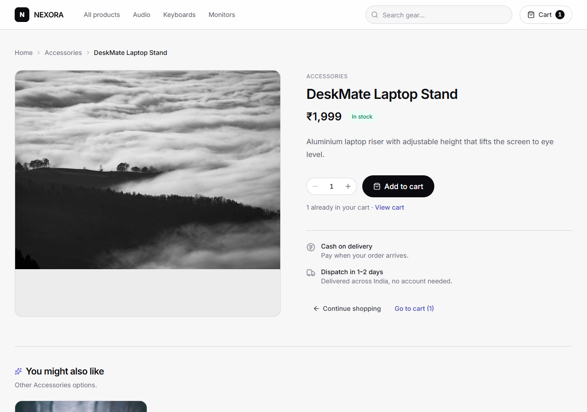
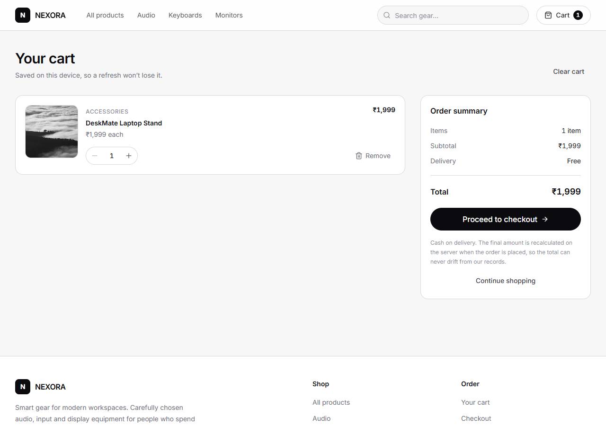
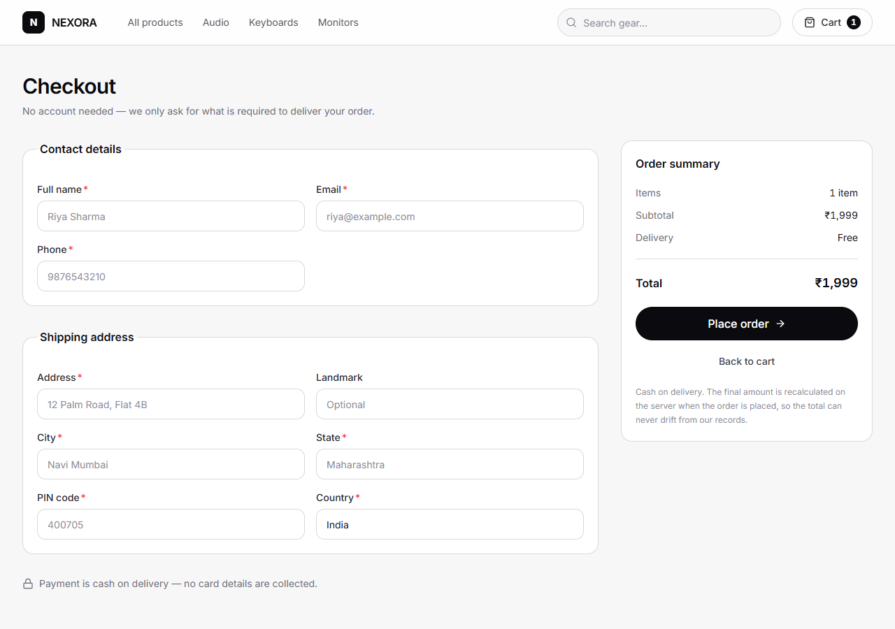
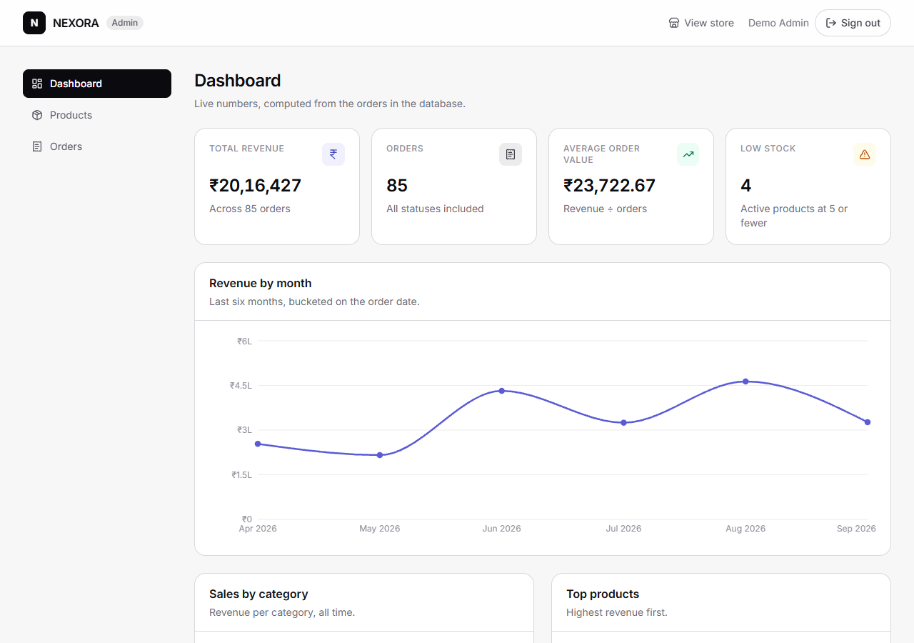
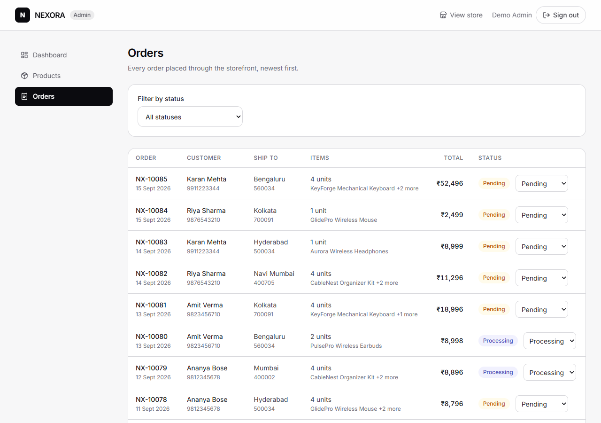
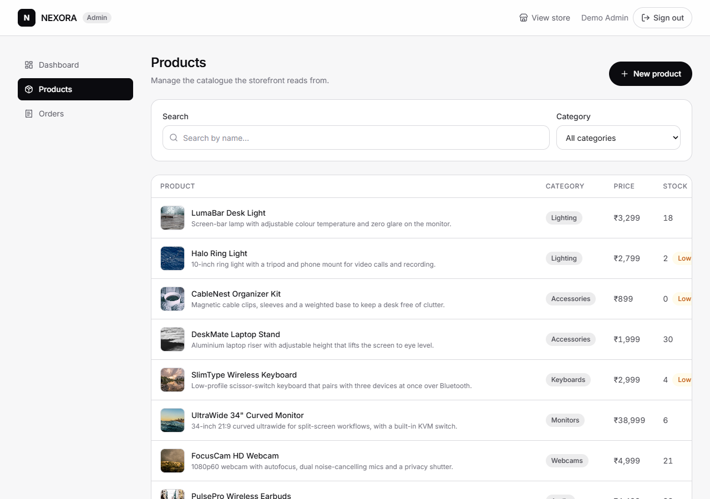

# NEXORA

**Smart gear for modern workspaces.** An e-commerce storefront with an admin dashboard, built as a monorepo.

Storefront (browse → cart → checkout → order) and admin dashboard (products, orders, analytics) share one
Express + MongoDB backend.

## Stack

| Layer | Choice |
|---|---|
| Frontend | React + Vite, Tailwind CSS, React Router, Axios (Context for cart + auth) |
| Backend | Node.js + Express |
| Database | MongoDB (Atlas) |
| Auth | JWT — admin only, seeded accounts, no registration |
| Deploy | Frontend → Vercel · Backend → Render · DB → Atlas |

## Status

- **Day 1 (backend core):** complete — models, product/order/auth APIs, seed script, error handling.
- **Day 2 (storefront):** complete — landing, listing (search / filter / sort / pagination), product
  details, cart, checkout, confirmation.
- **Day 3 (admin + analytics):** complete — 85 seeded historical orders, aggregation endpoint, admin
  login + protected routes, Recharts dashboard, product CRUD, order status workflow.
- **Day 4 (polish):** complete — recommendations, recently viewed, responsive pass, states audit,
  screenshots. Feature freeze.
- **Deploy (Vercel + Render):** pending.

## Architecture

```
        ┌──────────────────────── one Vite app ────────────────────────┐
        │                                                              │
        │   Storefront (eager)                 Admin (lazy chunk)      │
        │   /  /products  /products/:id        /admin/*                │
        │   /cart  /checkout  /confirmation    dashboard / products     │
        │                                      orders                  │
        └───────────────────────────┬──────────────────────────────────┘
                                    │  one Axios instance
                                    │  VITE_API_URL · bearer token · 401 clears session
                                    ▼
        ┌───────────────────── Express REST API ───────────────────────┐
        │  routes → controllers → models   │  middleware:             │
        │  products · orders · auth        │   errorMiddleware        │
        │  admin/analytics                 │   authMiddleware (JWT)   │
        └───────────────────────────┬──────────────────────────────────┘
                                    │  Mongoose
                                    ▼
                          MongoDB Atlas (nexora)

  Pricing, stock decrement, order numbers and every dashboard figure are
  computed server-side. The browser never sends a price or a total.
```

## Screenshots

| | |
|---|---|
| **Landing** — hero, honest value props, newest products<br> | **Listing** — search, category filter, sort, pagination<br> |
| **Product details** — stock-capped quantity, recommendations<br> | **Cart** — persisted locally, priced by the server<br> |
| **Checkout** — validated, no account required<br> | **Dashboard** — every figure from a real aggregation<br> |
| **Orders** — inline status workflow<br> | **Products** — create, edit, soft delete<br> |

## Stack


```
HAXCAMP/
├── backend/
│   ├── src/
│   │   ├── config/        env.js (validated config), db.js (Mongoose connection)
│   │   ├── constants/     CATEGORIES, ORDER_STATUSES, PAYMENT_METHODS, page sizes
│   │   ├── controllers/   productController, orderController, authController, analyticsController
│   │   ├── middleware/    errorMiddleware (asyncHandler + single error shape), authMiddleware (JWT)
│   │   ├── models/        Product, Order, Admin, Counter
│   │   ├── routes/        productRoutes, orderRoutes, authRoutes, analyticsRoutes
│   │   ├── utils/         ApiError, query + months helpers, seed.js, seedData.js, seedOrders.js
│   │   └── server.js
│   ├── .env.example       committed template — safe to read
│   └── .env               real secrets — gitignored, never committed
├── frontend/
│   ├── src/
│   │   ├── api/           single Axios instance (VITE_API_URL, token, 401 interceptor) + resource modules
│   │   ├── components/    ui/ primitives · layout/ shells · product/ · cart/ · order/ · admin/ · auth/
│   │   ├── context/       CartContext (localStorage), AuthContext (admin JWT), ToastContext
│   │   ├── hooks/         useApiResource, useProducts, useAdminData, useDebounce, useServerHealth
│   │   ├── lib/           constants, formatters, validation, cart/order storage, cn
│   │   ├── pages/store/   Landing, ProductListing, ProductDetails, Cart, Checkout, OrderConfirmation
│   │   └── pages/admin/   AdminRoutes (lazy), Login, Dashboard, Products, Orders
│   ├── .env.example       VITE_API_URL template
│   └── vercel.json        SPA rewrite + workspace-aware install command
├── .gitignore
├── .npmrc                 forces devDependencies to install (see note below)
├── package.json           npm workspaces root
├── render.yaml            backend blueprint for Render
└── plan-final.md
```

> **Why `.npmrc`?** npm omits `devDependencies` when `NODE_ENV=production` is set in the ambient
> environment. Vite and Tailwind are devDependencies and are required to *build* the frontend, so
> installs would silently skip them and fail with `vite: not recognized`. `include=dev` pins the
> behaviour everywhere, including host builds.

## Running the backend

```bash
npm install                 # from the repo root (installs all workspaces)

cp backend/.env.example backend/.env   # Windows: copy backend\.env.example backend\.env
# then edit backend/.env and set MONGODB_URI + JWT_SECRET

npm run seed                # resets products + admins, inserts 13 demo products
npm run dev                 # http://localhost:5000
```

From the root: `npm run dev`, `npm run start`, `npm run seed` all delegate to the `backend` workspace.

### Environment variables

Everything sensitive lives in `backend/.env` (gitignored). `.env.example` is the committed template.

| Variable | Required | Default | Notes |
|---|---|---|---|
| `MONGODB_URI` | yes | — | Atlas connection string |
| `JWT_SECRET` | yes | — | Long random string used to sign admin tokens |
| `PORT` | no | `5000` | |
| `NODE_ENV` | no | `development` | `production` hides stack traces |
| `JWT_EXPIRES_IN` | no | `1d` | |
| `CORS_ORIGINS` | no | `http://localhost:5173` | Comma-separated allow-list — no wildcard |
| `LOW_STOCK_THRESHOLD` | no | `5` | Used by analytics (Day 3) |
| `ADMIN_NAME` / `ADMIN_EMAIL` / `ADMIN_PASSWORD` | no | see `.env.example` | Private admin, created by seed |
| `DEMO_ADMIN_NAME` / `DEMO_ADMIN_EMAIL` / `DEMO_ADMIN_PASSWORD` | no | see `.env.example` | Demo admin published in this README |

The server exits immediately on boot if `MONGODB_URI` or `JWT_SECRET` is missing.

## Running the frontend

```bash
npm install                 # from the repo root
npm run dev:web             # http://localhost:5173
npm run build:web           # production build → frontend/dist
```

`VITE_API_URL` in `frontend/.env` points at the API (default `http://localhost:5000`).

### Storefront routes

| Route | Page |
|---|---|
| `/` | Landing — hero, value props, four newest products, categories, brand story |
| `/products` | Listing — `?search=&category=&sort=&page=` (URL is the source of truth, so links are shareable) |
| `/products/:id` | Product details |
| `/cart` | Cart — persisted to localStorage |
| `/checkout` | Validated checkout form → creates the order |
| `/confirmation` | Order confirmation — order number kept in sessionStorage so a refresh still shows it |

### Admin routes

Lazy-loaded at `/admin/*`, so the storefront bundle never downloads the dashboard or Recharts.

| Route | Page |
|---|---|
| `/admin/login` | Sign in (surfaces the demo credentials with a fill button) |
| `/admin/dashboard` | Revenue / orders / AOV / low-stock cards, revenue-by-month line, sales-by-category bars, top products |
| `/admin/products` | Catalogue table with search + category filter, create / edit / archive |
| `/admin/orders` | Every order with an inline status dropdown and a status filter |

Protected routes redirect anonymous visitors to `/admin/login` and return them to where they were
heading afterwards. A `401` from any request clears the session (axios interceptor) and bounces back to
the login screen.

## API

All responses are `{ "success": true, "data": ... }` or `{ "success": false, "message": "..." }`.

| Method | Endpoint | Auth | Description |
|---|---|---|---|
| GET | `/api/health` | — | Liveness probe (frontend pings this on load) |
| GET | `/api/products` | — | List products. Query: `search`, `category`, `sort`, `page`, `limit` |
| GET | `/api/products/:id` | — | Single product |
| GET | `/api/products/:id/recommendations` | — | Up to 4 same-category products, closest price first |
| POST | `/api/products` | Admin | Create product |
| PUT | `/api/products/:id` | Admin | Update product |
| DELETE | `/api/products/:id` | Admin | **Soft delete** (`isActive: false`) |
| POST | `/api/orders` | — | Create order — server-side pricing + atomic stock decrement |
| GET | `/api/orders` | Admin | List orders. Query: `status`, `page`, `limit` |
| PUT | `/api/orders/:id/status` | Admin | `Pending → Processing → Shipped → Delivered` |
| POST | `/api/auth/login` | — | Admin login → JWT (rate limited: 10 / 10 min) |
| GET | `/api/admin/analytics` | Admin | Dashboard aggregation (see below) |

`sort` accepts `newest`, `oldest`, `price-asc`, `price-desc`, `name-asc`, `name-desc`.
List endpoints return `{ items, total, page, limit, totalPages }`.

Admin routes take `Authorization: Bearer <token>`.

### Order request body

The client sends **only** product ids, quantities and customer details. Prices and totals are looked up
and computed on the server — a client-sent total is ignored.

```json
{
  "items": [{ "productId": "6512...", "qty": 2 }],
  "customer": { "name": "Riya Sharma", "email": "riya@example.com", "phone": "9876543210" },
  "shippingAddress": {
    "line1": "12 Palm Road", "city": "Navi Mumbai",
    "state": "MH", "postalCode": "400705", "country": "India"
  }
}
```

Stock is decremented with a conditional atomic update
(`{ _id, stock: { $gte: qty } }` + `$inc: { stock: -qty }`). If **any** line fails, every decrement
already applied is rolled back and the API returns **409** — so a partial order can never leak stock.

Each order item stores a **snapshot** (`name`, `price`, `category`, `image`) taken at purchase time, so
later product edits never rewrite historical revenue.

### Analytics response

`GET /api/admin/analytics` is computed entirely with MongoDB aggregation pipelines — nothing is
hardcoded, and every figure moves as soon as an order is placed.

```json
{
  "totalRevenue": 1567772,
  "totalOrders": 85,
  "averageOrderValue": 18444.38,
  "lowStockCount": 4,
  "lowStockThreshold": 5,
  "revenueByMonth": [{ "month": "2026-04", "label": "Apr 2026", "revenue": 427541, "orders": 19 }],
  "salesByCategory": [{ "category": "Monitors", "revenue": 778975, "units": 25 }],
  "topProducts": [{ "productId": "6512...", "name": "UltraWide 34\" Curved Monitor", "category": "Monitors", "revenue": 428989, "units": 11 }]
}
```

Months are bucketed in UTC and labelled from a fixed table, and months with no orders are returned as
zero so the chart stays continuous. The by-month series always reconciles with `totalRevenue` and
`totalOrders` — the seeder generates its history inside the same window that the endpoint charts, so the
two can't drift apart.

## Verification

What was actually exercised, rather than assumed:

**Automated API checks** (throwaway scripts, run against the live Atlas database)
- Products: search (case-insensitive, multi-word, regex-escaped), category filter, every sort mode,
  pagination clamping, malformed id → 400, unknown id → 404, mass-assignment stripped
- Orders: server pricing ignores a client-sent total, atomic stock decrement, **rollback verified** —
  a two-line order where the second line has insufficient stock returns 409 and the first line's
  decrement is undone, with no order persisted
- Auth: bcrypt login, wrong password → 401, no hash leaked, protected routes 401 without/with a bad token
- Analytics: 20/20 — including that the by-month series reconciles exactly with `totalRevenue` and
  `totalOrders`, and that placing an order moves the totals and recalculates AOV
- Recommendations: 13/13 — never the subject product, always the same category, never crosses
  categories, error paths correct

**Browser walkthrough** (headless Chrome, real clicks)
- Full order placed from the storefront → order visible in MongoDB with the exact cart total
- Cart persisted across a hard refresh; confirmation survived a refresh via sessionStorage
- Checkout blocked on invalid input (focus moves to the first bad field) and surfaced the API's 409
- Admin: protected route redirects when logged out, dashboard numbers match the API, product
  create → edit → archive (confirmed as a soft delete in the database), order status change persisted,
  status filter matched the API's counts exactly
- Responsive: 7 routes at 375px and 768px — body width equals the viewport, no sideways scroll
- Console clean across the whole session

## Seeded data

`npm run seed` wipes products, admins and orders, then inserts:

- **13 demo products** across 7 categories. Images use placeholder URLs (`picsum.photos`) — replace them
  with real product image URLs from the admin UI.
- **85 historical orders** spread across the last six months, with explicit `createdAt` timestamps and
  the same item snapshots a live order would store. Status follows age: older orders have had time to
  reach Delivered, only recent ones are still Pending.
- **The two admin accounts** below.

**The dashboard is pre-populated with seeded demo orders.** They are real database documents aggregated
by real queries — not hardcoded numbers. Seeded history does not decrement product stock: it is a record
of past sales, so current stock figures stay consistent with the seeded catalogue.

### Demo credentials

| Account | Email | Password |
|---|---|---|
| Demo admin | `demo@nexora.dev` | `Demo@12345` |
| Private admin | value of `ADMIN_EMAIL` in `.env` | value of `ADMIN_PASSWORD` in `.env` |

## Deploying the frontend (Vercel)

Import the repo in Vercel and set:

- **Root Directory:** `frontend`
- **Install Command:** `cd .. && npm install` (already set in `frontend/vercel.json`) — the dependency
  tree lives at the repo root because this is an npm workspace
- **Build Command:** `npm run build`
- **Output Directory:** `dist`
- **Environment variable:** `VITE_API_URL` = your Render URL, e.g. `https://nexora-api.onrender.com`

`frontend/vercel.json` also contains the SPA rewrite, so refreshing `/products/:id` or `/confirmation`
serves `index.html` instead of a 404.

Then add the Vercel URL to the backend's `CORS_ORIGINS` in Render (comma-separated) — the API rejects
unknown origins by design.

## Deploying the backend (Render)

A `render.yaml` blueprint is committed at the repo root. In Render choose **New > Blueprint**, pick this
repo and Apply — it sets up the build/start commands and health check, and prompts for the secret values
(`sync: false` keeps them out of git).

Equivalent manual settings, if you prefer creating the service by hand:

- Root directory: **repository root** — this is an npm workspace monorepo, so the build runs at the root
- Build command: `npm install`
- Start command: `npm start` (delegates to the `backend` workspace)
- Health check path: `/api/health`

`backend/.env` is gitignored and is **not** deployed — Render injects the variables below directly into
the process environment, and the server reads `PORT` from Render.

| Variable | Value |
|---|---|
| `MONGODB_URI` | your Atlas connection string |
| `JWT_SECRET` | the same long random string as local |
| `NODE_ENV` | `production` |
| `CORS_ORIGINS` | your Vercel URL (comma-separated; add localhost during development) |
| `ADMIN_EMAIL` / `ADMIN_PASSWORD` | private admin credentials |
| `DEMO_ADMIN_EMAIL` / `DEMO_ADMIN_PASSWORD` | demo admin credentials |

In Atlas, add `0.0.0.0/0` to Network Access so Render can reach the cluster.

Render free instances sleep when idle; the frontend shows a "waking up the server…" message on the
first request.
